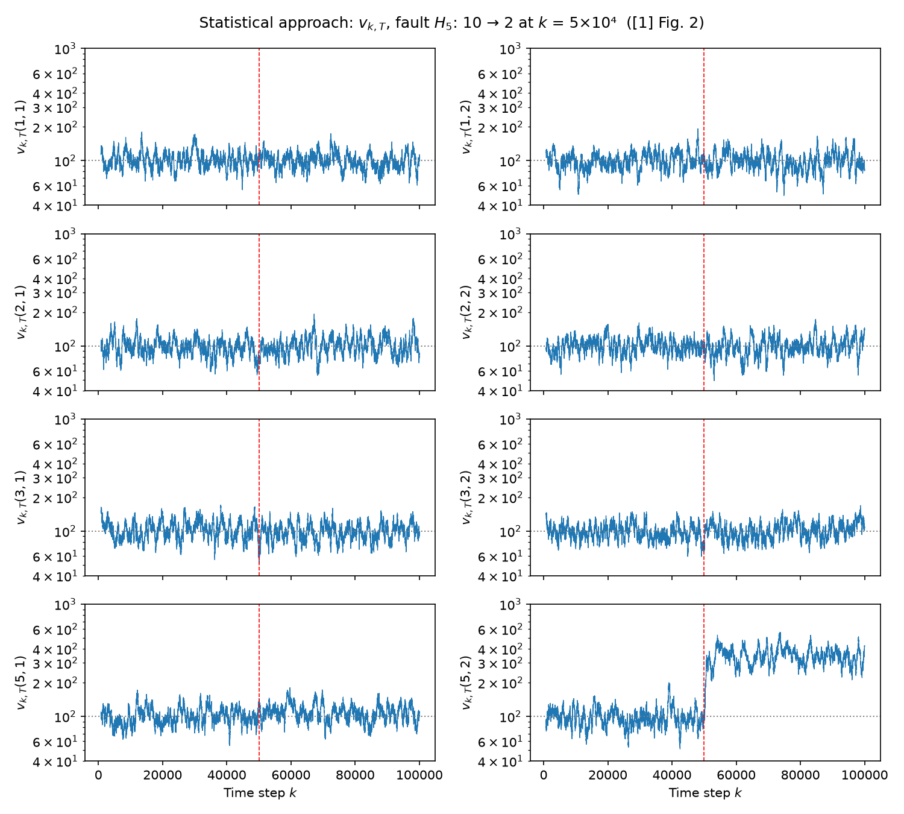
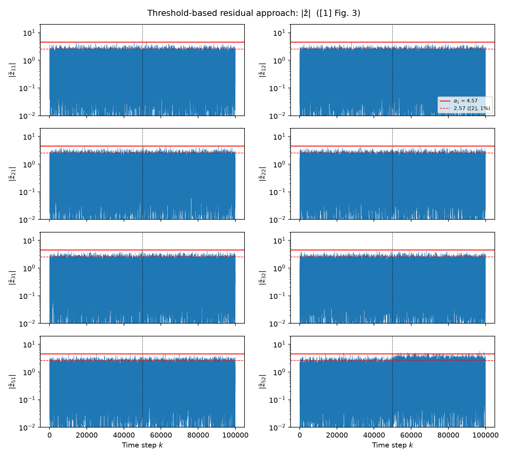

# Phase C: Network Simulation and Fault Detection

Script: [`phase_c.py`](../phase_c.py) · Reproduces [1] Sec. V, Figs. 2 and 3

## Objective

Phases A and B were each tested on their own. Phase C connects them and repeats
the paper's power network experiment:

1. Simulate the 4-area network (Scenario 3) for 100 000 steps. At $\bar k$ = 50 000,
   area 5's inertia drops, $H_5$: 10 → 2.
2. Run each area's estimator with the **healthy** model the whole time. After the
   fault, the estimator's predictions no longer match the plant, and that mismatch
   is the anomaly to detect.
3. Feed each area's normalised residual into two detectors and compare them:
   - **Statistical test** (Phase A): $v_{k,T}$, [1] Fig. 2
   - **Simple threshold** on $|\check z|$ (the baseline from Boem [2]), [1] Fig. 3

The paper's claim to check: **the statistical test detects the fault, and the simple threshold does not.**

## Pipeline

```
 detector_stats.npz ─┐
                     ├─▶ simulate plant + estimators ─▶ ž_i(k) per area ─┬─▶ v_{k,T} per channel ─▶ Fig. 2
 estimator_gains.npz ┘   (fault in area 5 for k > k̄)                    └─▶ |ž| vs threshold    ─▶ Fig. 3
```

At each step $k$ (`simulate`):

| Step | Equation | Source |
|---|---|---|
| Measure | $y_i = C x_i + v_i$ | [1] eq. (30) |
| Residual | $\tilde z_i = y_i - C\hat x_i$ | [1] Sec. II |
| Normalise | $\check z_i = \Gamma_i^{-1/2}\tilde z_i$ | [1] eq. (10) |
| Update estimator | $\hat x_i \leftarrow \sum_{j} A_{ij}\hat x_j + L_{ij}\tilde z_j$ (healthy model) | [1] eq. (4) |
| Update plant | $x_i \leftarrow \sum_{j} A_{ij}x_j + w_i$ (post-fault $A_{5j}$ for $k > \bar k$) | [1] eq. (30), Prop. 4.1 |

The detector then runs separately on each of the 8 residual channels
(4 areas × 2 outputs: angle $\Delta\theta$ and frequency $\Delta\omega$), with $D = 1$, $L = 3$, $T = 800$, $I = 100$.

## Running

```bash
python phase_a.py   # once, builds detector_stats.npz
python phase_b.py   # once, builds estimator_gains.npz
python phase_c.py   # simulation + figures
```

## Results

Values below are from a run with the default seed.

**Check [2]: residuals before the fault.** Every area's $\check z$ has covariance ≈ $I$
(0.986–1.010) and lag-1 autocorrelation ≈ 0 (|acf| ≤ 0.010). This confirms the paper's
assumption (11) that healthy normalised residuals are white standard normal, and shows
that the Phase B estimator works inside the full network.

**Check [3]: statistical test ([1] Fig. 2).**

| Channel | Mean $v$ before | Mean $v$ after | Ratio |
|---|---|---|---|
| Areas 1, 2, 3, both channels | 98.8–104.1 | 99.6–102.4 | 0.96–1.03 |
| Area 5, angle (5,1) | 100.7 | 108.7 | 1.08 |
| **Area 5, frequency (5,2)** | **98.4** | **347.3** | **3.53** |

**Check [4]: detection in area 5.**
- **Frequency (5,2): detected.** The alarm first triggers 318 steps after the fault
  and stays on 100 % of the time once the detector window holds only post-fault data.
- **Angle (5,1): not reliably detected.** The alarm is on only 8 % of the time.

**Check [5]: simple threshold ([1] Fig. 3), share of steps with $|\check z| >$ threshold.**

| Channel | > 2.57 before → after | > 4.57 before → after |
|---|---|---|
| Areas 1, 2, 3 | ≈ 1 % → ≈ 1 % | ≈ 0 → ≈ 0 |
| Area 5, angle | 0.98 % → 1.22 % | 0 → 0.002 % |
| **Area 5, frequency** | 0.98 % → 5.05 % | 0.002 % → **0.04 %** |

For $\mathcal N(0,1)$ noise the expected shares are 1.02 % above 2.57 and 0.0005 % above 4.57.

**How to read the figures:**



**Fig. 2 (`fig2_statistical.png`):** healthy panels hover around the dotted line at 100.
The bottom-right panel steps up at the red dashed line (the fault) and stays up.



**Fig. 3 (`fig3_residual.png`):** all panels look almost the same before and after the fault.
Only the bottom-right band gets slightly thicker, and it rarely reaches the solid 4.57 line.

These copies in `docs/img/` are a snapshot of the default-seed run. Re-running
`phase_c.py` writes fresh figures next to the script, not here.

## Significance

- **The paper's main claim holds.** A drop in inertia hardly changes the *size* of the
  residuals, so a threshold on $|\check z|$ barely notices it: 0.04 % crossings at 4.57.
  What the fault does change is the residuals' *time correlation*, which the statistical
  test picks up clearly (3.5× jump, alarm on continuously). This matches [1] Prop. 4.1:
  a parameter change makes the residuals correlated over time.
- **The fault stays in area 5.** Areas 1–3 show no change, so the distributed detector
  identifies the faulty area. This works because Phase B cancels the coupling between
  areas exactly.
- **Why the frequency channel reacts:** $H_5$ appears only in the frequency (swing)
  equation, so the model mismatch hits $\Delta\omega_5$ directly.
- **Inertia faults are only visible through dynamics.** $H_i$ only scales how fast
  frequency changes, so the network's steady state doesn't depend on it. Here the
  fault shows up only through how noise moves through the changed dynamics.
  A load held constant doesn't help: this was tested on the `experiment/load-input` branch.
- **False alarms are higher than nominal.** Before the fault, the alarm fires 1.7–5.9 %
  of the time instead of $1-\alpha$ = 1 %. This is the finite-window effect seen in
  Phase A check [4]. The $\chi^2$ result is exact only as $T \to \infty$. It's why
  check [4] asks for the alarm to *stay on* rather than counting single alarms.

## Comparison with the paper

| [1] Sec. V says | This implementation | Match |
|---|---|---|
| Fig. 2: change in subsystem 5 is "conspicuous" | (5,2) jumps 3.5× and stays up | ✅ |
| Fig. 2: subsystems 1–3 unaffected | ratios 0.96–1.03 | ✅ |
| Fig. 3: residual shows "a slight increase afterward" | only (5,2) band slightly thicker | ✅ |
| Fig. 3: threshold 4.57 makes detection "almost not possible" | 0.04 % of steps cross | ✅ |
| Fig. 2: **both** subsystem 5 panels marked "Anomaly Detection" | only (5,2) responds; (5,1) ratio 1.08 | ❌ |
| Fig. 3: residual of subsystem 5 has a **spike at $\bar k$** | no spike | ❌ |

## Open gaps

Ordered by how much each could change the figures.

### 1. Area 5's angle channel (5,1) doesn't respond

**Affects:** Fig. 2, bottom-left panel. **Status:** unresolved.

**Likely cause:** discretisation. [1] doesn't say whether it uses
- **Dss:** each area discretised separately, as here, or
- **D:** the whole network discretised at once. Both are defined in HyCon2 [5].

With Dss the coupling cancels exactly ($A_{ij} - L_{ij}C = 0$) and the areas' errors are fully decoupled.
With D, every block of $A$ fills in, so the coupling no longer cancels and residuals are only
approximately white. That could change which channels react. It could also raise the healthy
level of $v$ above 100: the left-column axes of the paper's Fig. 2 are marked at 500 and 1000,
while ours sit near 100.

**Also unconfirmed:** how the post-fault plant was built. Here area 5 is re-discretised on its own.

**Next step:** add a D option to Phase B and re-run Phase C.

**Ask the supervisor:** was [1] discretised per area (Dss) or as a whole network (D)?

### 2. No residual spike at $\bar k$

**Affects:** Fig. 3, subsystem 5. **Status:** cause identified, awaiting confirmation.

**Assumption here:** $u_i = 0$ (no load input). [1] eq. (30) includes a $\bar B_i u_i$ term with
$u_i = \Delta P_{L,i}$ following [2], but never gives a load profile for the 10⁵-step run.

**What was tested** (branch `experiment/load-input`):
- **HyCon2 Table 5 loads at $k$ = 5–40, then held:** results identical to $u_i = 0$, number for number.
  The network settles long before the fault, and a settled network doesn't depend on $H_5$.
- **The same load steps starting right after $\bar k$:** a spike appears in $|\check z_{51}|$ at $\bar k$,
  crossing 4.57, like the paper. Fig. 2 is unchanged, because the transient lasts about 40 steps
  and the window averages over 800.

**Conclusion:** the paper's spike probably comes from a load change near $\bar k$, but [1] doesn't say so.

**Ask the supervisor:** what load profile did [1] use, and did the load change near $\bar k$?

### 3. Choices that don't change the figures

These are documented for completeness. Confirm them, but they don't affect Figs. 2 and 3.

| Item | Choice here | Why it doesn't change the figures |
|---|---|---|
| Alarm threshold $\alpha$ | 0.99 (not given in [1]) | Fig. 2 plots $v$, not alarms; Fig. 3 uses fixed thresholds |
| $\varsigma_i$ definition | self-inclusive, as in [2] ([1] omits self) | Only changes the Phase B stability check; gains are the same |
| $L_{ij}$ design | least squares ([1] states an ∞-norm LP) | Both give the same unique $L_{ij}$, since the coupling cancels exactly |
| Initial state | $x(0) = \hat x(0) = 0$, as in [2] | Transient dies out within a few steps; the first $v$ is at $k$ = 801 |
| Fig. 3 dashed line | $2.57$ on $\lvert\check z\rvert$ | [2]'s own detector uses a looser bound $B_i \ge \Phi_i$ and needs two consecutive crossings. The line is a reference, not [2]'s exact detector. |

### 4. Not yet done

- **Attack scenarios.** [1] Sec. V says the intricate attack (27) and replay attacks give
  results "akin to" Figs. 2 and 3, without showing them. Before running these, confirm
  whether $\gamma$ in (27) should be $\{0,1\}$ (as printed, but not stealthy) or $\{-1,+1\}$
  (truly stealthy). See Phase A check [6].

## Output files

| File | Contents |
|---|---|
| `fig2_statistical.png` | $v_{k,T}$ for each area (rows) and channel (columns), log scale, fault at red dashed line |
| `fig3_residual.png` | $\lvert\check z\rvert$ for each area and channel with thresholds 4.57 (solid) and 2.57 (dashed) |
| `phase_c_results.npz` | `zcheck_<i>` (100 000 × 2), `v_<i>_<l>` (100 000), `fault_k`, `n_steps`, `seed` |
